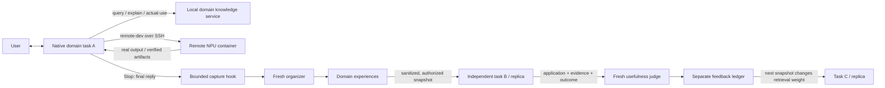

# MindIE Agent · Codex

Codex adapter for MindIE Agent's first domain experience loop. The user works in
the native Codex task; this plugin adds **one entry skill, three knowledge tools,
and eleven core remote-dev tools**.
The initial domain is `vllm-ascend`.



This repository owns Codex packaging, hook translation and the fresh Codex
maintenance runner. Content, retrieval, publication, use identity, feedback and
distribution belong to the knowledge runtime. This is a new plugin entrypoint;
it does not install the old workspace bootstrap, updater or VAWS business skill catalog.

Codex, knowledge, capture, organization and judging run on the user's local side.
The remote server supplies the NPU execution environment. The plugin reuses
remote-dev's SSH transport, endpoint/container semantics, owned jobs and artifact
hash verification. Its thin wrapper selects the core read/write/search/patch,
shell/job and artifact tools without duplicating their schemas or implementation.
It does not provision a remote knowledge server or copy Codex credentials remotely.

## Development installation

Requires Python 3.11+, `uv`, and an authenticated Codex CLI supporting plugins/hooks.
The runtime requirements pin the knowledge implementation to a reviewed commit:

```sh
uv venv --python 3.11 .venv
uv pip install --python .venv/bin/python -r runtime-requirements.txt
python3 plugins/mindie-agent/scripts/setup.py --knowledge-python "$PWD/.venv/bin/python"
codex plugin marketplace add "$PWD"
codex plugin add mindie-agent@mindie-agent
```

Review and trust this plugin's two hooks in Codex, then start a new task. Installation
does not automatically grant hook trust. This development release does not change
user hook trust or other installed plugins. In the task, use `$mindie-agent` for
a vLLM-Ascend request and authorize the plugin's tools through Codex; querying
selects the domain for that task. Inspect status with:

```sh
python3 plugins/mindie-agent/scripts/bridge.py status
python3 plugins/mindie-agent/scripts/bridge.py shutdown
```

`setup.py` creates only `~/.config/mindie-agent/codex{,.engine}.json` by default;
it refuses to overwrite existing configuration. Data defaults to
`~/.local/share/mindie-agent/vllm-ascend`. Set `MINDIE_AGENT_CONFIG` to use a separate
adapter configuration. Keep the runtime checkout/venv and configured runner path
available. A packaged release installer is a subsequent packaging step.

## What enters the loop

| Record | Meaning |
|---|---|
| Knowledge | Reference with source, revision and explicit applicability |
| Experience | Reusable advisory material, including failed attempts; no confidence score or mandatory version |
| Use | An experience applied in another task, with actual observed evidence |
| Feedback | A fresh judge's assessment of that use: helpful, unhelpful or unknown |

`knowledge_query` and `knowledge_explain` retrieve references. `knowledge_use`
records actual application; it does not cast a vote. The ordinary final reply
supplies the use outcome. Repeated use of the same entry in one task contributes
at most one evaluation. Producer self-use is excluded. Unknown has no weight effect.

The default vLLM-Ascend setup reads the organization-owned public knowledge feed
from `vllm-ascend-workspace/vaws-knowledge`, branch `knowledge/vllm-ascend`, every
five minutes. It never uses a personal fork as the official source. `--no-public-feed`
disables this read. The independent reader validates committed export hashes and
applicability before switching searchable content; errors retain the last valid
generation. Cases are experiences, topics are versioned knowledge, and maintenance
diaries are excluded. This is polling; source-repository event monitoring belongs
to the separately operated Grok maintainer.

Newly collected content stays local by default. `--auto-publish` explicitly authorizes
sanitized organized entries for distribution. `--upstream CONNECTION_JSON`
explicitly enables snapshot sync and sharing completed use evidence with that
trusted service. **Raw hook captures are never part of a snapshot.** Actual
application/evidence/outcome records are sent to the configured judge service;
configure only a service authorized to receive them. Organizer and judge use the
user's authenticated Codex service and consume model usage.

The initial distribution transport connects trusted domain services, including
local replicas or an operator-managed HTTPS endpoint/tunnel. It is not a public
multi-tenant service. Tokens are service credentials, not proof of human identity.

## Failure behavior and limits

- Stop sends only the current task's final reply, never hidden reasoning or other
  conversations. Missing/offline capture is discarded; there is no offline retry queue.
- Organizer/judge run outside the interactive task. A failed judge produces no vote
  and is not automatically retried. Inspect status for failed captures/evaluations.
- Initial retrieval reuses the knowledge package's BM25 index, capped at 10,000
  entries per domain. It does not claim semantic/vector retrieval or large-corpus performance.
- Feedback adjusts ranking and can withdraw an experience from search while preserving
  it for inspection. It does not make an experience authoritative knowledge.
- The first use's evidence and following final reply are immutable for that task/reference.
  Later human corrections/retractions need a subsequent feedback-revision feature.
- This iteration exercises one domain. Native cross-domain task creation/communication,
  other Harness adapters, production distribution and organization/repository renaming
  remain separate work. User-installed skills and tools remain under user control.

## Validation

The [real-source and remote NPU acceptance report](docs/real-acceptance-2026-09-18.md)
records actual Grok publication, local feed ingestion, two independent native
tasks with 16 NPU operator checks, and feedback propagation into retrieval.
Grok event delivery remains pending acceptance.

```sh
python3 -m unittest discover -s tests -p 'test_*.py'
# Opt-in: actual model calls, native hooks/MCP, three independent service roots.
.venv/bin/python tests/live_acceptance.py --output .local/acceptance/run-1
```

The live test uses a synthetic CPU helper whose package imports unavailable
`torch_npu`. Task A investigates it; a fresh organizer captures the approach;
independent task B retrieves and applies it; a fresh judge evaluates the observed
use; replica C checks the changed retrieval score. It is not an NPU correctness,
real-user effectiveness or multi-Harness acceptance test. Local raw logs are ignored by Git.

## Codex integration references

[Official hook events and trust](https://learn.chatgpt.com/docs/hooks) and
[plugin packaging](https://developers.openai.com/plugins/build/plugins).
Bundled stdio MCP uses a plugin-relative `cwd` and script path: the installed CLI
does not expand `${PLUGIN_ROOT}` in compatibility MCP arguments
([upstream report](https://github.com/openai/codex/issues/35762)). Hook commands use
the supported `${PLUGIN_ROOT}` environment variable.
