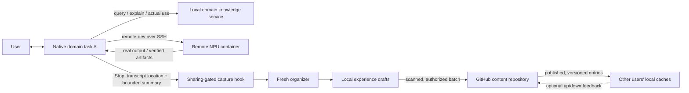

# MindIE Agent · Codex

Codex adapter for MindIE Agent's first domain experience loop. The user works in
the native Codex task; this plugin adds **one entry skill, fourteen migrated
vLLM-Ascend domain skills, four knowledge tools, and eleven core remote-dev tools**.
The initial domain is `vllm-ascend`; the retired Triton workspace skills live as an
unsupported, separate domain seed under `domains/triton-ascend/` and are not loaded
by this plugin.



This repository owns Codex packaging, hook translation and the fresh Codex
maintenance runner. Content, retrieval, publication, use identity, feedback and
distribution belong to the knowledge runtime. This is a new plugin entrypoint;
it does not install the old workspace bootstrap, updater or VAWS business skill catalog.

Codex, knowledge, capture and organization run on the user's local side.
The remote server supplies the NPU execution environment. The plugin reuses
remote-dev's SSH transport, endpoint/container semantics, owned jobs and artifact
hash verification. Its admission wrapper exposes generated upstream schemas for the core read/write/search/patch,
shell/job and artifact tools. It loads the remote implementation only after session admission;
`export_catalog.py` regenerates the discovery snapshot from the pinned runtime.
It does not provision a remote knowledge server or copy Codex credentials remotely.

## Development installation

Requires Python 3.11+, `uv`, and an authenticated Codex CLI supporting plugins/hooks.
The runtime requirements pin the knowledge implementation to a reviewed commit:

```sh
uv venv --python 3.11 .venv
uv pip install --python .venv/bin/python -r runtime-requirements.txt -r domain-requirements.txt
python3 plugins/mindie-agent/scripts/setup.py --knowledge-python "$PWD/.venv/bin/python"
codex plugin marketplace add "$PWD"
codex plugin add mindie-agent@mindie-agent
```

Review and trust this plugin's Stop hook in Codex, then start a new task. Installation
does not automatically grant hook trust. This development release does not change
user hook trust or other installed plugins. In the task, use `$mindie-agent` for
a vLLM-Ascend request and authorize the plugin's tools through Codex. Implicit skill
invocation is disabled. The manually invoked skill runs `bridge.py activate` using
native `CODEX_THREAD_ID`, then passes the returned session ID and activation capability
to every knowledge and remote MCP call. A query cannot activate a session.
Activation performs one bounded cold start plus an authenticated domain bind
(`capture: bound`), so Stop capture never depends on issuing a knowledge query;
`knowledge_query` itself is strictly on demand. `bridge.py deactivate` revokes
this session without touching other tasks. Leases last
at most 24 hours and are bound to this adapter configuration; renewal requires another
explicit user invocation. Do not put activation values in reports or other tasks.
Domain skill CLIs under `plugins/mindie-agent/skills/` run locally against the user's
business directory (the entry skill is `plugins/mindie-agent/skills/mindie-agent`,
invoked as `$mindie-agent`); when the adapter is configured they require
`MINDIE_SESSION_ID`/`MINDIE_ACTIVATION` exported from the activation step.
Inspect the existing service without starting it:

```sh
python3 plugins/mindie-agent/scripts/bridge.py status
python3 plugins/mindie-agent/scripts/bridge.py shutdown
```

`setup.py` creates only `~/.config/mindie-agent/codex{,.engine}.json` by default;
it refuses to overwrite existing configuration. Data defaults to
`~/.local/share/mindie-agent/vllm-ascend`. Set `MINDIE_AGENT_CONFIG` to use a separate
adapter configuration. Keep the runtime checkout/venv and configured runner path
available until the managed updater has installed a pinned runtime generation.

## Automatic plugin updates

On macOS, enable the deterministic updater after the development installation:

```sh
python3 plugins/mindie-agent/scripts/auto_update.py enable --source-root "$PWD" --channel main
python3 plugins/mindie-agent/scripts/auto_update.py status
```

The user LaunchAgent `org.mindie-agent.plugin-updater` checks the official
`mindie-agent/mindie-agent-codex` main branch every five minutes while logged in.
It never opens a Codex task, calls a model, activates a session, or starts the
knowledge service. Its only Codex operations are plugin marketplace and installation
commands. A stable launcher selects the committed generation, so later updater
code changes take effect on the next check too. Network failures use an hourly cooldown after three failed checks.
Each check has a 240-second subprocess budget; each subprocess has its own shorter
deadline and owned process-group cleanup. The same commit gets at most three
preparation/installation attempts across restarts. A missing compatibility contract
is recorded once and waits for a different commit.

The updater snapshots the current local safety fixes, then uses independent,
immutable directories under `~/.local/share/mindie-agent/updates`. It never pulls,
resets or stashes the developer checkout. A candidate must declare
`update-contract.json`, preserve explicit session admission and bounded Stop hooks,
and pin the official runtime repositories to exact commits. A fresh runtime must
pass admission/budget capability probes before installation. MCP entrypoints,
Skill files and hook definitions are installed together. Runtime revisions follow
the adapter's dependency pins, not independent floating repository heads.

Installation waits until all valid manual leases have been deactivated or expired
(at most 24 hours), active calls have released their lock, and maintenance is idle.
It stops the idle old knowledge service and atomically switches the adapter to the
new runtime/engine configuration. The next explicit invocation starts services lazily.
Successful updates retain old execution directories and cached entrypoints.
Pre-contract cached adapters without the update lock are retained as inert shims;
their original bytes are backed up separately and never automatically restored. Failed
or interrupted installs restore the previous runtime and marketplace; recovery is
also limited to three attempts. No automatic cache cleanup removes a live path.

Codex loads new Skill and MCP definitions in a **new task**. Changed hook definitions
require native hook trust review; the updater never edits trust or bypasses it.
Installation status therefore does not claim that every existing task is using the
new version. `waiting_for_compatible_source` means the current remote commit cannot
safely replace the installed version; `waiting_for_idle` means a validated update
is staged for a later check. Read the local status for the concrete reason.

The update channel is stored in `~/.config/mindie-agent/updater.json`. When stable
releases are available, switch explicitly using the same enable command with
`--channel release`; this resolves GitHub's latest non-draft, non-prerelease release
tag to an exact commit. Until then, keep `main`. Disable only this updater with:

```sh
python3 ~/.local/share/mindie-agent/updates/controller/auto_update.py disable
```

`auto_update.py uninstall` removes scheduling and updater-owned state after
preflighting active leases and live references; it never deletes retained native
cache entrypoints or the generation backing the installed plugin, and keeps
rollback metadata unless `--purge` runs with no live references. The updater also
tops up a generation installed by a previous controller with the pinned
`domain-requirements.txt` runtime (bounded, observable, three attempts per
revision). Windows scheduling (Task Scheduler), locks, process bounds and
filesystem publishing (an unprivileged directory junction with a journal-covered,
non-atomic swap in place of the POSIX symlink swap) are implemented with standard
primitives and marked unverified pending real hardware.

The first managed install can snapshot locally tested safety fixes even when they
are not yet on main. Remote updates remain pending until those fixes and the matching
knowledge runtime commit pins are published. This does not publish local changes.

## What enters the loop

| Record | Meaning |
|---|---|
| Knowledge | Reference with source, revision and explicit applicability |
| Experience | Reusable advisory material, including failed attempts and their corrections |
| Feedback | An optional, explicit up/down vote on one entry revision, with an optional one-line reason |

`knowledge_query` and `knowledge_explain` retrieve references; `knowledge_feedback`
records an optional vote. There is no runtime judge and no mandatory application,
evidence or outcome report. Silence is never recorded as a vote.

The default vLLM-Ascend setup follows the public content repository
`mindie-agent/knowledge-vllm-ascend`, branch `main`, checked every
five minutes. It never uses a personal fork as the official source. `--no-public-feed`
disables this read. The independent reader validates committed export hashes and
applicability before switching searchable content; errors retain the last valid
generation. Cases are experiences, topics are versioned knowledge, and maintenance
diaries are excluded. This is polling; source-repository event monitoring belongs
to the separately operated Grok maintainer.

Community sharing is a separate switch from plugin activation and defaults OFF.
`setup.py --community-*` records the explicitly selected repository, project scope,
account and public visibility; `bridge.py sharing-enable|sharing-disable|sharing-status`
toggles it later. While sharing is off, the Stop hook captures nothing: no transcript
reading, no drafts, no worker, no model. While it is on, filtered, scanned experience
batches are contributed to the configured GitHub content repository as pull requests;
merging belongs to the maintainer-authorized review bot. **Raw transcripts, local
paths and capture logs are never part of a contribution.** The organizer uses the
user's authenticated Codex service and consumes model usage; PR assembly, voting
records and feed sync use no model calls.

## Failure behavior and limits

- The only registered hook is Stop. Its shell always returns empty JSON with
  exit code 0, including a missing script/interpreter; it cannot request continuation.
  Native timeout: 2 seconds; capture subprocess deadline: 1.2 seconds; no retry.
  Input is bounded at 128 KiB and summaries at 32,768 characters. Recursive,
  inactive and duplicate session/turn events are dropped before loading the runtime.
  Each admitted delivery is consumed durably before execution, even if it fails.
  The retired `session-start` operation is rejected by current sources; caches
  from pre-contract versions are kept callable only through the inert retired
  entrypoint, which answers it with empty JSON.
- Installation, MCP initialize/tools-list and hook receipt never activate a task.
  Discovery reads only a bundled schema file. Every business call requires a
  session ID and matching local capability from manual activation; a missing
  adapter configuration or a missing/expired lease fails closed (the old
  no-configuration development bypass is removed). The knowledge
  service also checks admission, so old clients without credentials fail closed.
  Shared runtime configurations opt into this check with `session_activation`.
- Knowledge calls have a **15-second absolute process deadline**; remote calls
  have **65 seconds**. Each submitted business request gets **one attempt, zero
  automatic retries**. Knowledge startup spawns once, with a 5-second startup
  budget, at most 3 readiness probes after the initial/recheck probes, and a
  5-second business RPC socket timeout. A remote SSH connection is capped at
  10 seconds and each remote output wait at 30 seconds. Long jobs use the existing
  remote job API; a local timeout does not prove the remote operation was cancelled.
- MCP input is capped at 128 KiB and process output at 1 MiB. Four calls can be
  admitted concurrently per connection, with no pending execution queue. Duplicate
  request IDs are refused (up to 4,096 tracked IDs per connection); cancellation and
  disconnect kill owned local process groups. Transport discovery itself may be
  loaded by Codex before invocation; this is not a claim of zero shim processes.
- Three consecutive failed MCP calls pause **that session**. A later in-flight
  success cannot unpause it. Another explicit user invocation may issue a new
  capability; it does not reset hook attempt history or maintenance budgets.
  Deactivation stops new calls/captures and queued maintenance admission; an
  already admitted operation remains bounded by its deadline.
- Status and shutdown have a 5-second outer deadline and never start a service.
  No failure triggers a repair task, new model turn, or automatic activation.
  Active cache paths are retained on upgrade; retired adapters must fail closed
  until the task loads the current plugin. Unrelated plugin/configuration is unchanged.
- Background maintenance admits **at most 6 calls per session, 20 per domain in
  a rolling hour, one at a time**, including unsuccessful attempts. The local
  SQLite ledger reserves each logical item before starting the process; restarts
  never replay an attempted item. Three consecutive failures pause maintenance
  until an explicit `maintenance-resume` command. Resume preserves quotas and
  does not replay discarded work. Read the reason through `bridge.py status`.
- Each maintenance Codex invocation has a 60-second deadline (65 seconds for the
  enclosing worker). Input is limited to 64 KiB, process output to 128 KiB, and the
  final result to 32 KiB. Owned process groups are cleaned up on failure or timeout.
  The worker aborts on error events, tool attempts or a second turn. These are
  invocation and time limits, not a provider-side token or billing quota; the
  native client's internal network behavior is not an exact token accounting API.
  POSIX uses owned process groups; Windows uses a new process group plus tree
  kill, implemented but not yet verified on real hardware.
- Stop sends only the current task's final reply, never hidden reasoning or other
  conversations. Missing/offline capture is discarded; there is no offline retry queue.
- The organizer runs outside the interactive task. A failed organization consumes
  its input region and is not automatically retried. There is no judge role.
- Initial retrieval reuses the knowledge package's BM25 index, capped at 10,000
  entries per domain. It does not claim semantic/vector retrieval or large-corpus performance.
- Feedback is one current up/down vote per task and entry revision, replaceable by
  the same voter. Downvotes with concrete counterevidence support correction or
  retirement by the publishing side; retired entries leave ordinary search while old
  references stay readable. Votes never make an experience authoritative knowledge.
- This iteration exercises one domain. Native cross-domain task creation/communication,
  other Harness adapters, production distribution and organization/repository renaming
  remain separate work. User-installed skills and tools remain under user control.

## Validation

The [real-source and remote NPU acceptance report](docs/real-acceptance-2026-09-18.md)
records the previous design's acceptance run (judge/upstream architecture, since
removed). Current-architecture acceptance is owned by root and tracked in
`../reports`.

```sh
python3 -m unittest discover -s tests -p 'test_*.py'
# With the pinned/patched runtime interpreter, regenerate then compare the catalog:
.venv/bin/python plugins/mindie-agent/scripts/export_catalog.py
```

Current-architecture acceptance is owned by root; no in-repo model harness
remains. Local raw logs are ignored by Git.

## Codex integration references

[Official hook events and trust](https://learn.chatgpt.com/docs/hooks) and
[plugin packaging](https://developers.openai.com/plugins/build/plugins).
Bundled stdio MCP uses a plugin-relative `cwd` and script path: the installed CLI
does not expand `${PLUGIN_ROOT}` in compatibility MCP arguments
([upstream report](https://github.com/openai/codex/issues/35762)). Hook commands use
the supported `${PLUGIN_ROOT}` environment variable.
